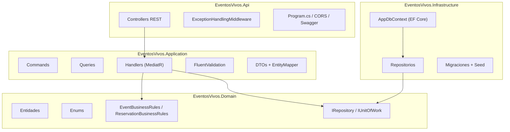
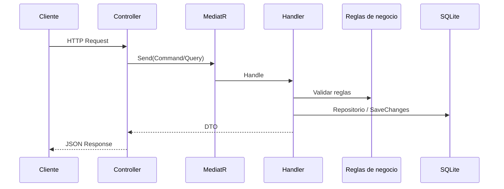

# EventosVivos — Backend API

API REST para la gestión de eventos en vivo, reservas y reportes de ocupación. Desarrollada con **.NET 9** siguiendo **Clean Architecture**.

## URLs desplegadas

| Entorno | URL |
|---------|-----|
| API (Render) | https://eventos-vivos-api.onrender.com |
| Swagger (solo local) | http://localhost:5080/swagger |

## Stack tecnológico

- .NET 9 / ASP.NET Core Web API
- Entity Framework Core 9 + SQLite
- MediatR (CQRS)
- FluentValidation
- xUnit + FluentAssertions + Moq (pruebas unitarias)
- Docker (despliegue en Render)

---

## Arquitectura

El proyecto separa responsabilidades en capas concéntricas. Las reglas de negocio viven en el **dominio** y no dependen de infraestructura ni de la API.



### Capas

| Capa | Proyecto | Responsabilidad |
|------|----------|-----------------|
| **Domain** | `EventosVivos.Domain` | Entidades, enums, excepciones de dominio, reglas RN01–RN07, contratos de repositorio |
| **Application** | `EventosVivos.Application` | Casos de uso (commands/queries), handlers MediatR, validación de entrada, mapeo a DTOs |
| **Infrastructure** | `EventosVivos.Infrastructure` | EF Core, SQLite, repositorios, migraciones, seed de venues |
| **Api** | `EventosVivos.Api` | Controllers REST, CORS, middleware de errores, composición DI |
| **Tests** | `EventosVivos.UnitTests` | 19 pruebas unitarias (dominio + handlers) |

### Flujo de una petición



### Patrones aplicados

- **Clean Architecture** — dependencias hacia el dominio
- **CQRS** — commands y queries separados vía MediatR
- **Repository** — abstracción de persistencia
- **Unit of Work** — transacciones con `SaveChangesAsync`
- **Pipeline Validation** — FluentValidation antes de ejecutar handlers

---

## Modelo de dominio

### Entidades

- **Venue** — sede con capacidad máxima
- **Evento** — evento con fechas, precio, tipo y estado
- **Reserva** — comprador, cantidad, estado y código de confirmación

### Tipos de evento válidos

`conferencia` | `taller` | `concierto`

### Estados

**Evento:** `activo` | `cancelado` | `completado`

**Reserva:** `pendientepago` | `confirmada` | `cancelada` | `cancelacionevento` | `perdida`

### Reglas de negocio principales

| Regla | Descripción |
|-------|-------------|
| RN01 | Capacidad del evento no supera la del venue |
| RN02 | Sin solapamiento de eventos activos en el mismo venue |
| RN03 | Eventos en fin de semana no inician después de las 22:00 (hora Bogotá) |
| RN04 | Reserva no permitida con menos de 1 hora para el inicio |
| RN05 | Límites de cantidad según precio y proximidad del evento |
| RN06 | Eventos pasados se marcan como completados |
| RN07 | Cancelación confirmada a menos de 48 h → estado `perdida` |

---

## API REST

Base URL local: `http://localhost:5080/api`

### Venues

| Método | Ruta | Descripción |
|--------|------|-------------|
| GET | `/venues` | Listar venues |

### Eventos

| Método | Ruta | Descripción |
|--------|------|-------------|
| GET | `/events` | Listar con filtros (`tipo`, `fechaDesde`, `fechaHasta`, `venueId`, `estado`, `titulo`) |
| POST | `/events` | Crear evento |
| GET | `/events/{id}` | Detalle |
| POST | `/events/{id}/reservations` | Crear reserva |
| GET | `/events/{id}/occupancy-report` | Reporte de ocupación |
| POST | `/events/{id}/cancel` | Cancelar evento |

### Reservas

| Método | Ruta | Descripción |
|--------|------|-------------|
| GET | `/reservations` | Listar todas |
| GET | `/reservations/{id}` | Detalle por ID |
| POST | `/reservations/{id}/confirm-payment` | Confirmar pago (genera código `EV-XXXXXX`) |
| POST | `/reservations/{id}/cancel` | Cancelar reserva |

### Ejemplo — crear evento

```http
POST /api/events
Content-Type: application/json

{
  "titulo": "Conferencia Clean Code",
  "descripcion": "Charla sobre buenas practicas de desarrollo",
  "venueId": 1,
  "capacidadMaxima": 150,
  "inicio": "2026-08-15T18:00:00-05:00",
  "fin": "2026-08-15T20:00:00-05:00",
  "precioEntrada": 50,
  "tipo": "conferencia"
}
```

---

## Ejecución local

### Requisitos

- [.NET 9 SDK](https://dotnet.microsoft.com/download)

### Comandos

```powershell
cd backend
dotnet restore
dotnet run --project src/EventosVivos.Api --launch-profile http
```

- API: http://localhost:5080
- Swagger: http://localhost:5080/swagger

La base de datos SQLite (`eventosvivos.db`) se crea automáticamente con migraciones y seed de 3 venues.

### Pruebas unitarias

```powershell
dotnet test tests/EventosVivos.UnitTests
```

19 tests: reglas de dominio + handlers principales.

---

## Configuración

### appsettings.json

```json
{
  "ConnectionStrings": {
    "DefaultConnection": "Data Source=eventosvivos.db"
  },
  "Cors": {
    "AllowedOrigins": [
      "http://localhost:4200",
      "https://eventos-vivos-api.netlify.app"
    ]
  }
}
```

### Variables de entorno (producción / Render)

| Variable | Descripción |
|----------|-------------|
| `ASPNETCORE_ENVIRONMENT` | `Production` |
| `FRONTEND_URL` | URL del frontend para CORS (ej. `https://eventos-vivos-api.netlify.app`) |
| `PORT` | Puerto asignado por Render (automático) |

---

## Despliegue (Render + Docker)

1. Language: **Docker**
2. Root Directory: *(vacío si el repo es solo el backend)*
3. Dockerfile en la raíz del repo
4. Variable `FRONTEND_URL` con la URL de Netlify

```powershell
docker build -t eventos-vivos-api .
docker run -p 8080:8080 -e FRONTEND_URL=https://tu-front.netlify.app eventos-vivos-api
```

---

## Estructura del proyecto

```
backend/
├── Dockerfile
├── EventosVivos.sln
├── src/
│   ├── EventosVivos.Api/           # Controllers, Program, Middleware
│   ├── EventosVivos.Application/   # Handlers, Commands, Queries, DTOs
│   ├── EventosVivos.Domain/        # Entidades, reglas, interfaces
│   └── EventosVivos.Infrastructure/# EF Core, repositorios, migraciones
└── tests/
    └── EventosVivos.UnitTests/     # Pruebas unitarias
```
